# Diagram architektury UI - Moduł autentykacji QA Toolsmith

<!-- Instrukcje generowania diagramów Mermaid dla architektury UI

Jesteś doświadczonym architektem oprogramowania, którego zadaniem jest utworzenie diagramu Mermaid w celu wizualizacji architektury stron Astro i komponentów React dla modułu logowania i rejestracji. Diagram powinien zostać utworzony w następującym pliku: .ai/diagrams/ui.md

Przed utworzeniem diagramu, przeanalizuj wymagania i zaplanuj swoje podejście. Umieść swoją analizę wewnątrz tagów <architecture_analysis>.

Elementy do uwzględnienia w diagramie:
- Zaktualizowaną strukturę UI po wdrożeniu nowych wymagań
- Layouts, server pages i aktualizacje istniejących komponentów
- Grupowanie elementów według funkcjonalności
- Kierunek przepływu danych między komponentami
- Moduły odpowiedzialne za stan aplikacji
- Podział na komponenty współdzielone i komponenty specyficzne dla stron
- Zależności między komponentami związanymi z autentykacją a resztą aplikacji
- Wyróżnij komponenty, które wymagały aktualizacji ze względu na nowe wymagania

Rozpocznij diagram od składni:
```mermaid
flowchart TD
```

Przestrzegaj zasad składni Mermaid:
- Używaj spójnego formatowania ID węzłów
- Pamiętaj, że ID węzłów rozróżniają wielkość liter i muszą być unikalne
- Używaj poprawnych kształtów węzłów: [Tekst] dla prostokątów, (Tekst) dla zaokrąglonych
- Grupuj powiązane elementy za pomocą subgrafów
- Używaj węzłów pośrednich dla złożonych relacji
- Preferuj układ pionowy dla hierarchii
- Używaj poprawnych typów połączeń: --> , --- , -.-> , ==> , --Tekst-->
- Unikaj używania adresów URL, endpointów, nawiasów w nazwach węzłów
- Używaj spójnego nazewnictwa w całym dokumencie

Unikaj błędów:
- Brak deklaracji sekcji Mermaid i typu diagramu na początku
- Nieprawidłowe ID węzłów (niedozwolone znaki)
- Niezamknięte subgrafy (brakujący "end")
- Niezamknięte nawiasy kwadratowe w opisach węzłów

Po utworzeniu diagramu, przejrzyj go dokładnie pod kątem błędów składniowych. Umieść końcowy diagram w tagach <mermaid_diagram>.
-->

<architecture_analysis>

## Analiza architektury systemu autentykacji

### 1. Komponenty wymienione w dokumentacji:

**Strony Astro:**

- `/auth/login` - strona logowania
- `/auth/register` - strona rejestracji
- `/auth/reset` - formularz resetu hasła
- `/auth/reset/confirm` - potwierdzenie resetu hasła
- `/logout` - wylogowanie

**Layouty:**

- `PublicLayout.astro` - dla stron publicznych (generatory, KB read-only)
- `AuthLayout.astro` - dla stron autentykacji
- `Layout.astro` - główny layout (istniejący)
- `GeneratorLayout.astro` - layout generatorów (istniejący)

**Komponenty React:**

- `LoginForm.tsx` - formularz logowania
- `RegisterForm.tsx` - formularz rejestracji
- `ResetRequestForm.tsx` - żądanie resetu hasła
- `ResetConfirmForm.tsx` - potwierdzenie resetu hasła
- `TopBar.astro` - nagłówek z przyciskiem logowania

**API Endpoints:**

- `POST /api/auth/signup` - rejestracja
- `POST /api/auth/signin` - logowanie
- `POST /api/auth/signout` - wylogowanie
- `POST /api/auth/reset-request` - żądanie resetu
- `POST /api/auth/reset-change` - zmiana hasła

**Istniejące komponenty UI:**

- `ThemeToggle.tsx` - przełącznik motywu
- `Welcome.astro` - strona powitalna
- `GeneratorsList.tsx` - lista generatorów
- `IBANGeneratorView.tsx` - generator IBAN
- Komponenty shadcn/ui: `Button`, `Input`, `Card`, `Alert`

### 2. Główne strony i odpowiadające komponenty:

**Strony publiczne (bez logowania):**

- `/` - strona główna z `Welcome.astro`
- `/generators` - lista generatorów z `GeneratorsList.tsx`
- `/generators/iban` - generator IBAN z `IBANGeneratorView.tsx`

**Strony autentykacji:**

- `/auth/login` - `LoginForm.tsx` w `AuthLayout.astro`
- `/auth/register` - `RegisterForm.tsx` w `AuthLayout.astro`
- `/auth/reset` - `ResetRequestForm.tsx` w `AuthLayout.astro`
- `/auth/reset/confirm` - `ResetConfirmForm.tsx` w `AuthLayout.astro`

### 3. Przepływ danych między komponentami:

**Rejestracja:** `RegisterForm` → `POST /api/auth/signup` → Supabase Auth → automatyczne logowanie → przekierowanie
**Logowanie:** `LoginForm` → `POST /api/auth/signin` → Supabase Auth → sesja → przekierowanie
**Reset hasła:** `ResetRequestForm` → `POST /api/auth/reset-request` → email → `ResetConfirmForm` → `POST /api/auth/reset-change`
**TopBar:** sprawdza stan sesji → pokazuje przycisk logowania/wylogowania

### 4. Funkcjonalność komponentów:

- **Formularze autentykacji:** walidacja, obsługa błędów, nieujawnianie istnienia konta
- **TopBar:** dynamiczne przełączanie między stanem zalogowanym/niezalogowanym
- **Layouty:** różne układy dla różnych typów stron
- **Komponenty UI:** spójny design system z shadcn/ui
- **Middleware:** sprawdzanie sesji, rate limiting

```mermaid
flowchart TD
    %% Strony główne
    HomePage["/ - Strona Główna<br/>Welcome.astro"] --> PublicLayout["PublicLayout.astro<br/>Layout dla stron publicznych"]
    GeneratorsPage["/generators - Lista Generatorów<br/>GeneratorsList.tsx"] --> PublicLayout
    IBANPage["/generators/iban - Generator IBAN<br/>IBANGeneratorView.tsx"] --> GeneratorLayout["GeneratorLayout.astro<br/>Layout generatorów"]

    %% Strony autentykacji
    LoginPage["/auth/login - Logowanie<br/>login.astro"] --> AuthLayout["AuthLayout.astro<br/>Layout autentykacji"]
    RegisterPage["/auth/register - Rejestracja<br/>register.astro"] --> AuthLayout
    ResetPage["/auth/reset - Reset Hasła<br/>reset.astro"] --> AuthLayout
    ResetConfirmPage["/auth/reset/confirm - Potwierdzenie<br/>confirm.astro"] --> AuthLayout

    %% Komponenty formularzy
    LoginForm["LoginForm.tsx<br/>Formularz logowania<br/>- Walidacja email/hasło<br/>- Obsługa błędów<br/>- Rate limiting"] --> LoginPage
    RegisterForm["RegisterForm.tsx<br/>Formularz rejestracji<br/>- Walidacja danych<br/>- Auto-login po rejestracji<br/>- Nieujawnianie istnienia konta"] --> RegisterPage
    ResetRequestForm["ResetRequestForm.tsx<br/>Żądanie resetu hasła<br/>- Wprowadzenie email<br/>- Wysyłka linku resetu"] --> ResetPage
    ResetConfirmForm["ResetConfirmForm.tsx<br/>Potwierdzenie resetu<br/>- Nowe hasło<br/>- Walidacja tokenu"] --> ResetConfirmPage

    %% Nagłówek globalny
    TopBar["TopBar.astro<br/>Nagłówek globalny<br/>- Stan zalogowania<br/>- Przycisk logowania/wylogowania<br/>- Menu użytkownika"] --> PublicLayout
    TopBar --> AuthLayout
    TopBar --> GeneratorLayout

    %% Komponenty UI
    ThemeToggle["ThemeToggle.tsx<br/>Przełącznik motywu<br/>- Dark/Light mode<br/>- LocalStorage"] --> TopBar

    %% Komponenty shadcn/ui
    UIComponents["Komponenty shadcn/ui<br/>- Button.tsx<br/>- Input.tsx<br/>- Card.tsx<br/>- Alert.tsx<br/>- Form.tsx"] --> LoginForm
    UIComponents --> RegisterForm
    UIComponents --> ResetRequestForm
    UIComponents --> ResetConfirmForm
    UIComponents --> GeneratorsPage
    UIComponents --> IBANPage

    %% API Endpoints
    SignupAPI["POST /api/auth/signup<br/>Rejestracja użytkownika<br/>- Walidacja danych<br/>- Tworzenie konta<br/>- Auto-login"] --> RegisterForm
    SigninAPI["POST /api/auth/signin<br/>Logowanie użytkownika<br/>- Weryfikacja danych<br/>- Tworzenie sesji<br/>- Rate limiting"] --> LoginForm
    SignoutAPI["POST /api/auth/signout<br/>Wylogowanie<br/>- Czyszczenie sesji<br/>- Przekierowanie"] --> TopBar
    ResetRequestAPI["POST /api/auth/reset-request<br/>Żądanie resetu hasła<br/>- Wysyłka email<br/>- Generowanie tokenu"] --> ResetRequestForm
    ResetChangeAPI["POST /api/auth/reset-change<br/>Zmiana hasła<br/>- Walidacja tokenu<br/>- Aktualizacja hasła"] --> ResetConfirmForm

    %% Serwisy backendowe
    AuthService["AuthService.ts<br/>Serwis autentykacji<br/>- Integracja z Supabase<br/>- Mapowanie błędów<br/>- Zarządzanie sesją"] --> SignupAPI
    AuthService --> SigninAPI
    AuthService --> SignoutAPI
    AuthService --> ResetRequestAPI
    AuthService --> ResetChangeAPI

    %% Middleware i bezpieczeństwo
    Middleware["middleware/index.ts<br/>Middleware Astro<br/>- Sprawdzanie sesji<br/>- Rate limiting<br/>- CSRF protection"] --> SignupAPI
    Middleware --> SigninAPI
    Middleware --> SignoutAPI
    Middleware --> ResetRequestAPI
    Middleware --> ResetChangeAPI

    %% Baza danych
    SupabaseAuth["Supabase Auth<br/>- auth.users<br/>- Sesje JWT<br/>- Reset hasła"] --> AuthService
    ProfilesTable["public.profiles<br/>- id, email, role<br/>- RLS policies<br/>- Trigger auto-tworzenia"] --> AuthService

    %% Walidatory
    LoginValidator["login.validator.ts<br/>Walidacja danych logowania<br/>- Email format<br/>- Hasło strength<br/>- Normalizacja"] --> SigninAPI
    LoginValidator --> SignupAPI

    %% Obsługa błędów
    ErrorHandler["error.helper.ts<br/>Obsługa błędów<br/>- Mapowanie Supabase<br/>- Komunikaty użytkownika<br/>- Logowanie"] --> AuthService

    %% Rate Limiter
    RateLimiter["rate-limiter.service.ts<br/>Ograniczenie prób<br/>- Per IP/email<br/>- Blokada tymczasowa<br/>- Exponential backoff"] --> Middleware

    %% Styling
    GlobalCSS["global.css<br/>Globalne style<br/>- Tailwind CSS<br/>- Dark mode variables"] --> PublicLayout
    GlobalCSS --> AuthLayout
    GlobalCSS --> GeneratorLayout

    %% Przepływ danych - rejestracja
    RegisterForm -.->|"POST {email, password}"| SignupAPI
    SignupAPI -.->|"200 {userId}"| RegisterForm
    RegisterForm -.->|"Redirect to /"| HomePage

    %% Przepływ danych - logowanie
    LoginForm -.->|"POST {email, password}"| SigninAPI
    SigninAPI -.->|"200 {userId}"| LoginForm
    LoginForm -.->|"Redirect to /"| HomePage

    %% Przepływ danych - reset hasła
    ResetRequestForm -.->|"POST {email}"| ResetRequestAPI
    ResetRequestAPI -.->|"200 {ok: true}"| ResetRequestForm
    ResetRequestAPI -.->|"Email z linkiem"| ResetConfirmForm
    ResetConfirmForm -.->|"POST {token, newPassword}"| ResetChangeAPI
    ResetChangeAPI -.->|"200 {ok: true}"| ResetConfirmForm

    %% Przepływ danych - wylogowanie
    TopBar -.->|"POST /api/auth/signout"| SignoutAPI
    SignoutAPI -.->|"Redirect to /"| HomePage

    %% Grupowanie komponentów
    subgraph "Strony Publiczne"
        HomePage
        GeneratorsPage
        IBANPage
    end

    subgraph "Strony Autentykacji"
        LoginPage
        RegisterPage
        ResetPage
        ResetConfirmPage
    end

    subgraph "Formularze React"
        LoginForm
        RegisterForm
        ResetRequestForm
        ResetConfirmForm
    end

    subgraph "API Endpoints"
        SignupAPI
        SigninAPI
        SignoutAPI
        ResetRequestAPI
        ResetChangeAPI
    end

    subgraph "Serwisy Backendowe"
        AuthService
        LoginValidator
        ErrorHandler
        RateLimiter
    end

    subgraph "Baza Danych"
        SupabaseAuth
        ProfilesTable
    end

    subgraph "Komponenty UI"
        UIComponents
        ThemeToggle
    end

    subgraph "Layouty"
        PublicLayout
        AuthLayout
        GeneratorLayout
    end

    %% Stylowanie węzłów
    classDef authPage fill:#e1f5fe,stroke:#01579b,stroke-width:2px
    classDef authForm fill:#f3e5f5,stroke:#4a148c,stroke-width:2px
    classDef apiEndpoint fill:#fff3e0,stroke:#e65100,stroke-width:2px
    classDef service fill:#e8f5e8,stroke:#1b5e20,stroke-width:2px
    classDef database fill:#fce4ec,stroke:#880e4f,stroke-width:2px
    classDef uiComponent fill:#f1f8e9,stroke:#33691e,stroke-width:2px
    classDef layout fill:#fff8e1,stroke:#ff6f00,stroke-width:2px

    class LoginPage,RegisterPage,ResetPage,ResetConfirmPage authPage
    class LoginForm,RegisterForm,ResetRequestForm,ResetConfirmForm authForm
    class SignupAPI,SigninAPI,SignoutAPI,ResetRequestAPI,ResetChangeAPI apiEndpoint
    class AuthService,LoginValidator,ErrorHandler,RateLimiter service
    class SupabaseAuth,ProfilesTable database
    class UIComponents,ThemeToggle uiComponent
    class PublicLayout,AuthLayout,GeneratorLayout layout
```

  </architecture_analysis>

<mermaid_diagram>



</mermaid_diagram>

## Opis architektury

### Główne moduły systemu autentykacji:

1. **Strony Publiczne** - dostępne bez logowania (generatory, KB read-only)
2. **Strony Autentykacji** - dedykowane strony dla procesów logowania/rejestracji
3. **Formularze React** - interaktywne komponenty z walidacją i obsługą błędów
4. **API Endpoints** - serwerowe endpointy obsługujące operacje autentykacji
5. **Serwisy Backendowe** - logika biznesowa i integracja z Supabase
6. **Baza Danych** - Supabase Auth + tabele profili użytkowników
7. **Komponenty UI** - spójny design system oparty na shadcn/ui
8. **Layouty** - różne układy dla różnych typów stron

### Kluczowe przepływy danych:

- **Rejestracja:** Formularz → API → Supabase → Auto-login → Przekierowanie
- **Logowanie:** Formularz → API → Weryfikacja → Sesja → Przekierowanie
- **Reset hasła:** Żądanie → Email → Potwierdzenie → Nowe hasło → Logowanie
- **Wylogowanie:** Przycisk → API → Czyszczenie sesji → Przekierowanie

### Bezpieczeństwo:

- Rate limiting per IP/email z blokadą tymczasową
- Nieujawnianie istnienia konta w komunikatach błędów
- RLS (Row Level Security) w bazie danych
- CSRF protection i walidacja tokenów
- HttpOnly cookies dla sesji

### Zgodność z wymaganiami:

- ✅ US-001: Rejestracja z auto-login i walidacją
- ✅ US-002: Logowanie, wylogowanie, reset hasła, dostęp bez logowania do generatorów
- ✅ Rate limiting i blokada po serii błędów
- ✅ Dedykowane strony autentykacji
- ✅ Integracja z istniejącymi komponentami UI
